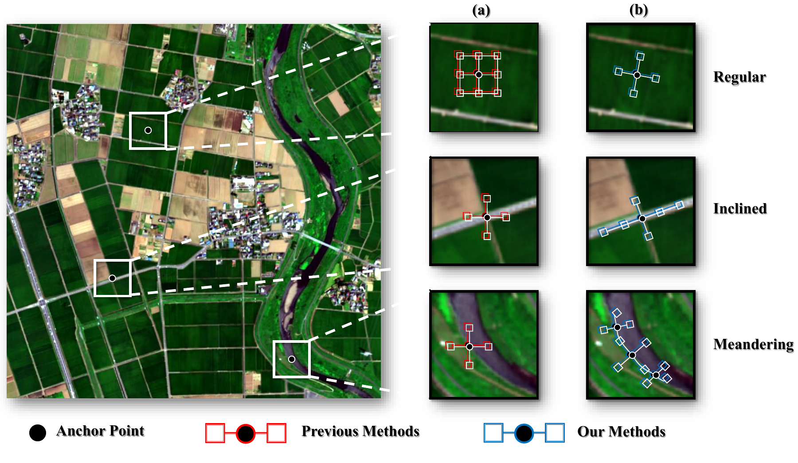
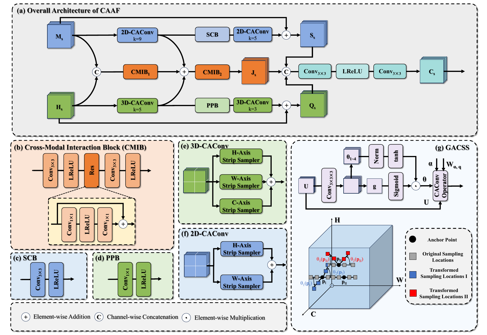
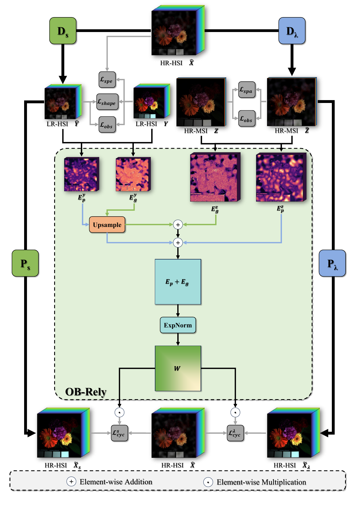

# Observation-Constrained Structure-Adaptive Representation Learning for Unsupervised Hyperspectral Image Fusion

## Abstract

Fusing a low-resolution hyperspectral image (LrHSI) with a high-resolution multispectral image (HrMSI) offers a practical way to obtain a high-resolution hyperspectral image (HrHSI) with rich spatial and spectral information. The scarcity of ground-truth HrHSI makes unsupervised learning from the observed image pair an attractive alternative to supervised fusion. In this setting, reconstruction depends on both the network's ability to represent image structures and the constraints that guide learning without ground truth. Conventional convolutions sample fixed locations, limiting their ability to follow variations in object shape and orientation. Meanwhile, matching the degraded reconstruction to the observations leaves ambiguities in the HrHSI and does not enforce consistent predictions when the same scene is rotated or reflected. Motivated by these limitations, we propose a Curvilinear- and Observation-Reliability-Aware (CORA) network that combines adaptive feature extraction with observation-constrained learning. A Curvilinear-Aware Asymmetric Fusion (CAAF) module uses deformable strip convolutions to follow local structures and asymmetric branches to extract complementary features from the two modalities. To further constrain reconstruction beyond observation matching, an Observation-Reliability-Guided Dual Pullback (ORDP) loss forms spatial and spectral degradation-reconstruction cycles. Because the network output serving as the cycle reference can contain errors, observation-based reliability weighting reduces the contribution of regions that disagree with the measurements. To exploit the expected consistency under changes in scene orientation, an equivariance loss over the dihedral group $D_4$ enforces agreement between transformed predictions and predictions from transformed inputs, using the eight rotations and reflections of a square. Experiments on CAVE, Pavia, and Chikusei demonstrate that CORA outperforms the compared methods in RMSE, PSNR, and SAM on all three datasets. On CAVE, it improves PSNR by 0.57 dB and reduces SAM by 20.9% relative to the strongest competing result for each metric. The code will be available at https://github.com/GitHubNetizenS/CORA.

## Method Overview

### Fig. 1: Adaptive Sampling

Adaptive strip sampling follows local structure orientations instead of relying on fixed sampling locations.

### Fig. 3: CAAF

The Curvilinear-Aware Asymmetric Fusion (CAAF) module combines modality-specific branches, cross-modal interaction, and deformable strip sampling.

### Fig. 4: Observation-Guided Training

Observation consistency and reliability-weighted spatial and spectral pullback cycles guide unsupervised reconstruction.

All eight original figures, including Figs. 2, 5, 6, 7, and 8, are available as PDFs in [`imgs/`](imgs/); click a preview above to open its PDF.
